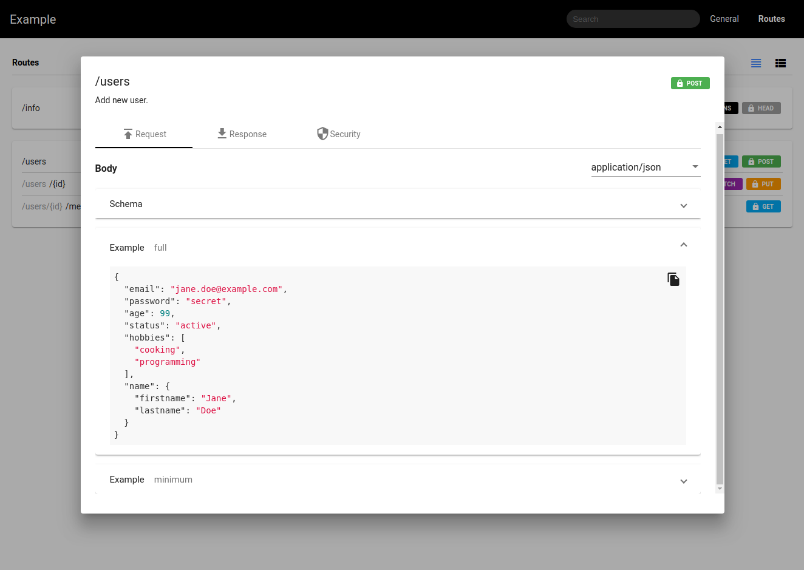

# raml2html material theme

[](https://travis-ci.org/KorbinianKuhn/raml2html-material-theme/builds)
[](https://snyk.io/test/github/KorbinianKuhn/raml2html-material-theme)
[](https://david-dm.org/KorbinianKuhn/raml2html-material-theme)
[](https://david-dm.org/KorbinianKuhn/raml2html-material-theme)
[](https://www.npmjs.com/package/raml2html-material-theme)
[](https://www.npmjs.com/package/raml2html-material-theme)
[](https://github.com/prettier/prettier)


- Compact overview
- Interactive search
- JSON Syntax Highlighting
- Copy examples to clipboard functionality
- Automatic example generation

## Installation

```
$ npm install -g raml2html-material-theme
```

## Usage

In javascript:

```javascript
const raml2html = require('raml2html');
const config = raml2html.getConfigForTheme('raml2html-material-theme');

// source can be a filename, url or parsed RAML object
const source = 'path/to/raml/file';
raml2html
  .render(source, config)
  .then(html => console.log(html))
  .catch(error => console.error(error));
```

On the command line:

```
raml2html \
--theme 'raml2html-material-theme' \
-o 'path/to/output/file.html' \
-i 'path/to/raml/file.raml'
```

## Example

[example.html](example/example.html)



## Contributing

raml2html-material-theme is an open source project and your contribution is very much appreciated. Fork this repository and push in your ideas.

## License

raml2html-material-theme is available under the MIT license. See the LICENSE file for more info.
